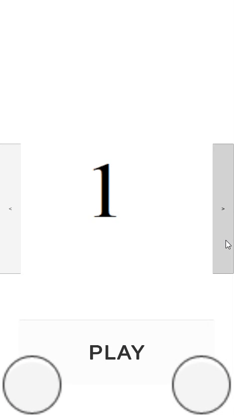

# Child Game Selector

A modular mini-game selection and launching system for Unity, designed for children's educational games using an event-driven MVP architecture with dependency injection.



## Overview

This project implements a simple game selection interface that allows children to browse through available mini-games and launch them. The architecture follows an event-driven MVP (Model-View-Presenter) pattern with elements of MVVM, using Zenject for dependency injection to create a clean, maintainable codebase.

## Core Features

### Game Selection Carousel

The selector provides an intuitive interface for children to navigate through available games:
- Left/right navigation buttons to cycle through games
- Preview images for each game
- Simple "Play" button to launch the selected game

### Modular Mini-Game Architecture

Games are implemented as separate modules that conform to the `IMiniGame` interface, making it easy to add new mini-games to the platform:

```csharp
public interface IMiniGame
{
    string SceneId { get; }
    Sprite PreviewImage { get; }
}

public abstract class BaseMiniGame : IMiniGame
{
    public abstract string SceneId { get; }
    public abstract Sprite PreviewImage { get; }
}
```

### Included Mini-Games

Currently, the platform includes two educational mini-games:

1. **Dentist Game** - Teaching children about dental hygiene
      
2. **Puzzle Game** - Educational puzzles for cognitive development

## Architecture

The project uses an event-driven MVP architecture with reactive elements:

### Core Infrastructure

- **BasePresenter/BaseView**: Abstract base classes that handle core functionality and lifecycle management
- **BindableProperty**: Reactive property implementation for data binding
- **BindingContext**: Manages view-presenter bindings and cleanup
- **CommandBus & CommandResolver**: Command pattern implementation for decoupled action handling
- **EventManager**: Pub/sub event system for cross-component communication
- **PresenterStageManager**: Manages presenter/view creation and lifecycle management
- **IModel Interface**: Defines the contract for model components

### Presentation Layer

- **Presenters**: Handle logic and update views (GameSelectorPresenter, NavigationPresenter, etc.)
- **Views**: UI components that forward events to presenters (GameSelectorView, NavigationView, etc.)
- **Lifetime Management**: Components use explicit disposal patterns with `IDisposable` implementation

### Domain Layer

- **MiniGamesProvider**: Responsible for initializing and providing access to available mini-games
- **MiniGameType**: Enum defining the types of mini-games available (Dentist = 10, Puzzle = 20)
- **MiniGameData**: Serializable data class for game configuration

### Game-Specific Components

- **DentistGameStartup**: Initializes the Dentist game components
- **PuzzleGameStartup**: Initializes the Puzzle game components
- **SpriteSlicer**: Utility for dynamically creating puzzle pieces from a source image

## Event-Driven System

The architecture uses an event-driven approach for communication between components:

```csharp
public class EventManager
{
    private readonly Dictionary<Type, List<Action<object>>> _eventSubscribers = new();
    
    public void Subscribe<T>(Action<T> handler)
    {
        if (!_eventSubscribers.ContainsKey(typeof(T)))
        {
            _eventSubscribers[typeof(T)] = new List<Action<object>>();
        }
        _eventSubscribers[typeof(T)].Add(obj => handler((T)obj));
    }
    
    public void Trigger<T>(T eventData)
    {
        if (!_eventSubscribers.ContainsKey(typeof(T)))
            return;
        foreach (var handler in _eventSubscribers[typeof(T)])
        {
            handler(eventData);
        }
    }
    }
```

## Presenter Implementation

Presenters act as mediators between views and models, handling user interactions and updating the UI:

```csharp
public class GameSelectorPresenter : BasePresenter<GameSelectorView>
{
    private MiniGamesProvider _miniGamesProvider;
    private IMiniGame _currentLoadedMiniGame;
    private BindableProperty<int> _currentGameIndex { get; } = new();
    
    [Inject]
    public void Construct(MiniGamesProvider miniGamesProvider)
    {
        _miniGamesProvider = miniGamesProvider;
        View.LeftButton.onClick.AddListener(() => SelectGame(SideIndex.Left));
        View.RightButton.onClick.AddListener(() => SelectGame(SideIndex.Right));
        View.PlayButton.onClick.AddListener(() => StartGame());
        ChangeIndex(0);
        _currentGameIndex.Bind(ChangeIndex, false, this);
    }
    }
```


## Dependency Injection

The project uses Zenject for dependency injection, providing clean separation of concerns:

```csharp
public class PresenterStageManager : IPresenterStageManager
{
    private readonly Transform _sceneContainer;
    private readonly Transform _canvasContainer;
    private readonly DiContainer _diContainer;
    private readonly ISpawnedContext _context;
    private readonly DiContainer _subContainer;
    
    public TPresenter CreatePanelPresenter<TPresenter, TPanel>(bool dontDestoryOnContextClean = false)
        where TPresenter : IPresenter
        where TPanel : MonoBehaviour, IView, IPanel
    {
        // Implementation...
    }
}
```

## Adding a New Mini-Game

To add a new mini-game to the platform:

1. Create a new entry in the `MiniGameType` enum
2. Implement a class that inherits from `BaseMiniGame` or implements `IMiniGame`
3. Create game-specific presenters and views
4. Create a startup class to register components
5. Register the new game in `MiniGamesProvider`

```csharp
// Example of registering games in MiniGamesProvider
public MiniGamesProvider(MiniGameData[] miniGameDatas)
{
    _gamesByType = new()
    {
        { MiniGameType.Dentist, InitMiniGame(miniGameDatas, MiniGameType.Dentist) },
        { MiniGameType.Puzzle, InitMiniGame(miniGameDatas, MiniGameType.Puzzle) }
    };
}
```

## Future Enhancements

- Add player progress tracking
- Implement difficulty levels for each game
- Add parental controls and settings
- Support for game categories and filtering
- Cloud save functionality for game progress